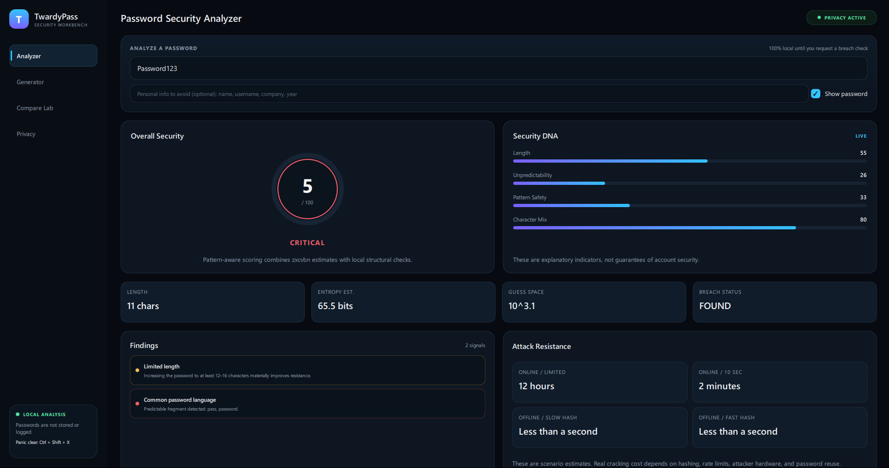
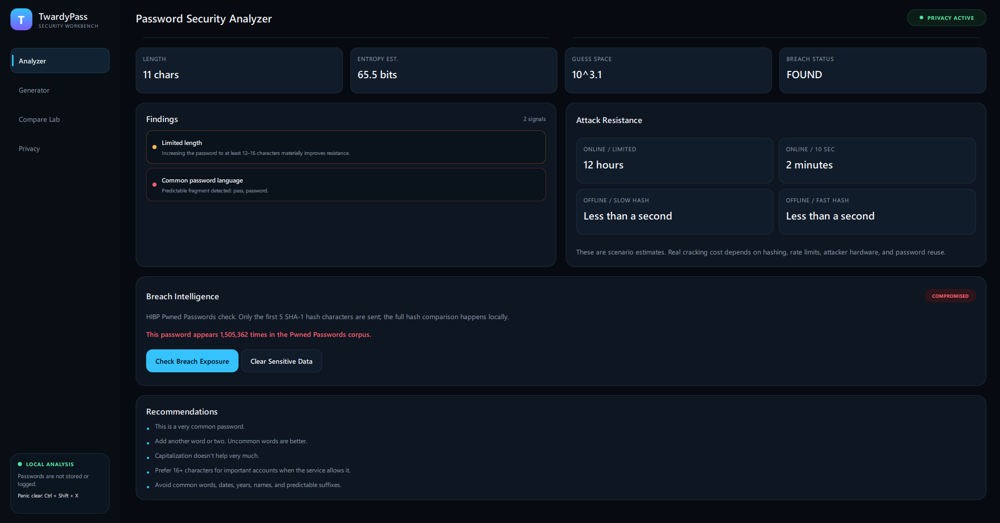
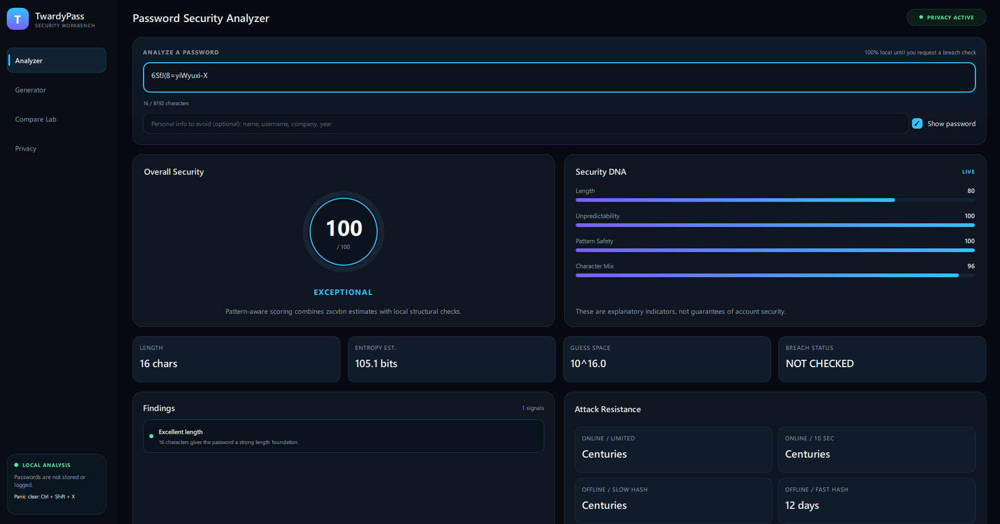
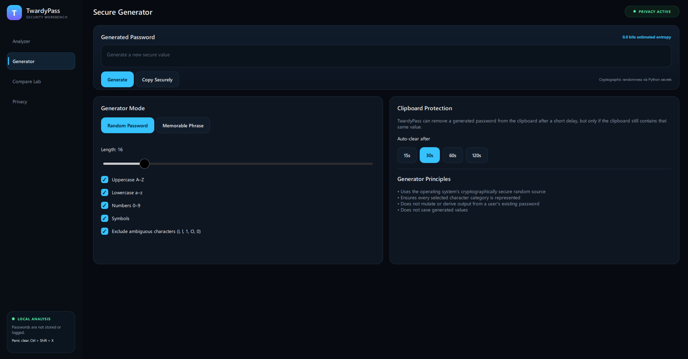
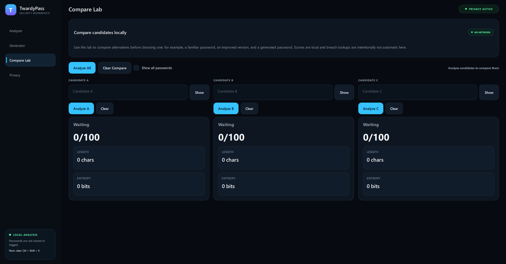
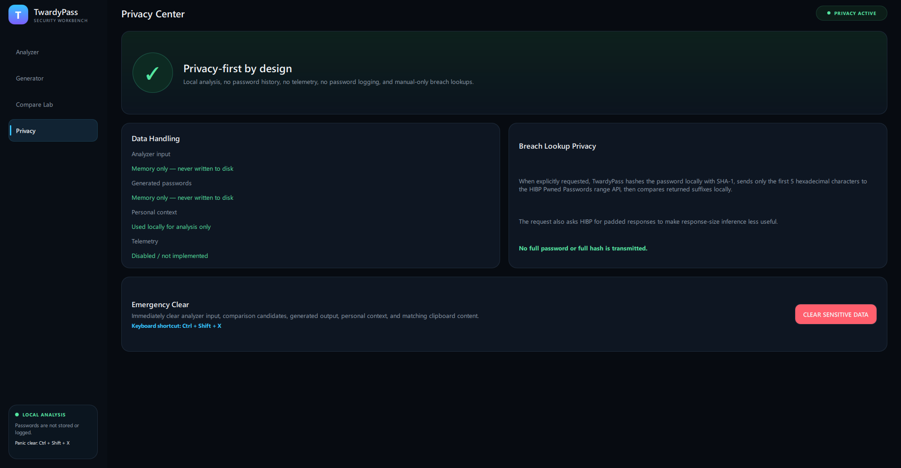

# TwardyPass

TwardyPass is a privacy-first desktop password security workbench built with Python, PySide6/QML, zxcvbn, and the Have I Been Pwned Pwned Passwords API.

## Preview








## Current features

- Real-time local password analysis
- Long-password analysis up to 8,192 characters
- 0–100 explanatory security score
- zxcvbn pattern-aware guessing estimates
- Security DNA indicators
- Local checks for sequences, keyboard walks, repeats, years, common fragments, and optional personal context
- Manual HIBP Pwned Passwords lookup using k-anonymity
- Padded HIBP range responses
- Cryptographically secure password generator
- Memorable passphrase generator
- Secure clipboard auto-clear
- Three-way local password comparison
- Panic clear shortcut (`Ctrl+Shift+X`)
- Dark QML dashboard UI

## Privacy model

TwardyPass does not store analyzed or generated passwords. Breach checks are manual. For HIBP Pwned Passwords checks, SHA-1 is computed locally and only the first five hexadecimal characters are sent to the range endpoint. Returned suffixes are compared locally.

## Run locally

```powershell
py -m venv .venv
.\.venv\Scripts\Activate.ps1
python -m pip install --upgrade pip
pip install -r requirements.txt
python main.py
```

## Tests

```powershell
pytest
```

## Important note

Password-strength and crack-time estimates are educational risk indicators, not guarantees. Real attack cost depends on password uniqueness, service rate limits, hashing algorithms, hardware, credential reuse, and other factors.

## License

TwardyPass is released under the **TwardyPass Non-Commercial Source License**.

You may use, study, modify, and redistribute the project for non-commercial purposes with attribution.

**Commercial use, resale, paid redistribution, or incorporation into commercial products or services requires prior written permission from Filip Twardowski.**

See [LICENSE](LICENSE) for the full terms.