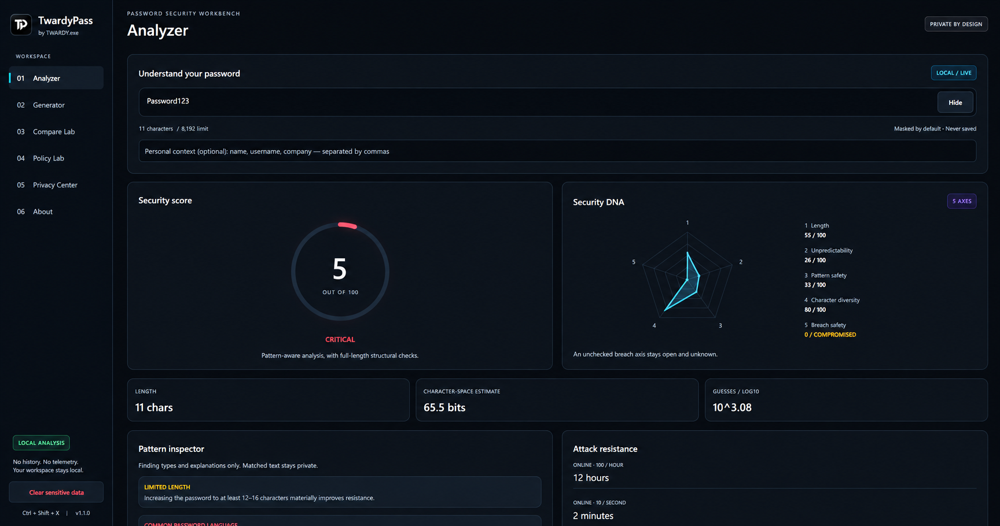
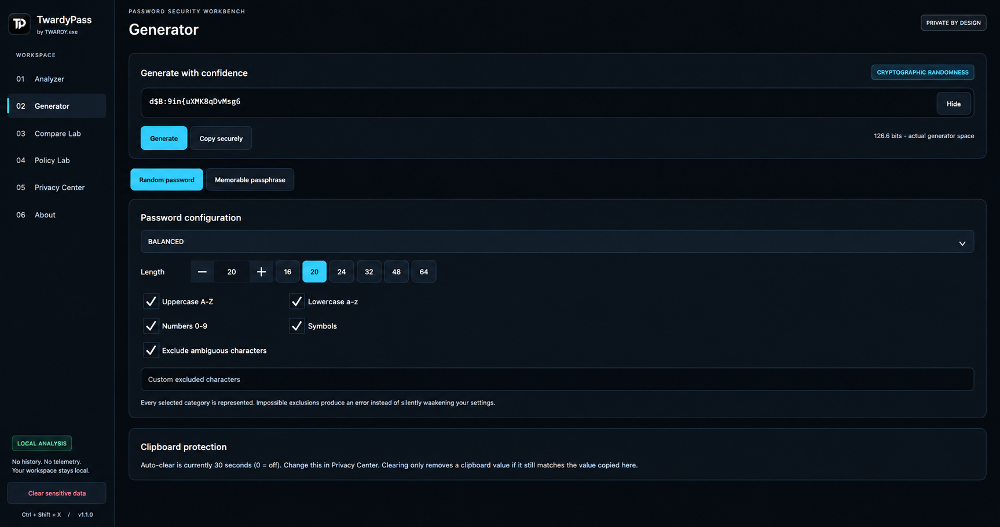
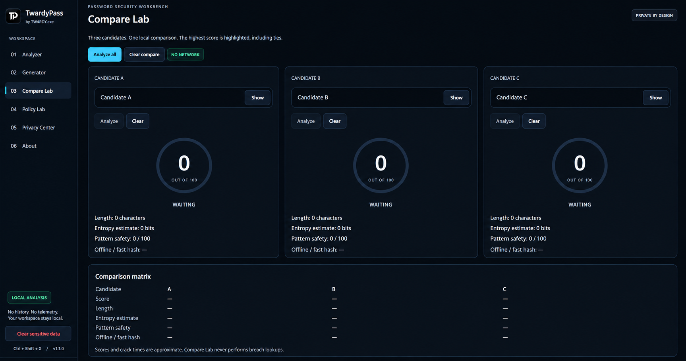
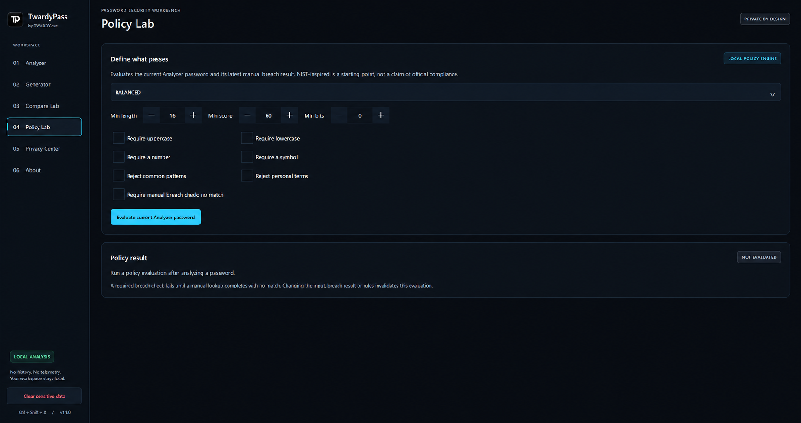
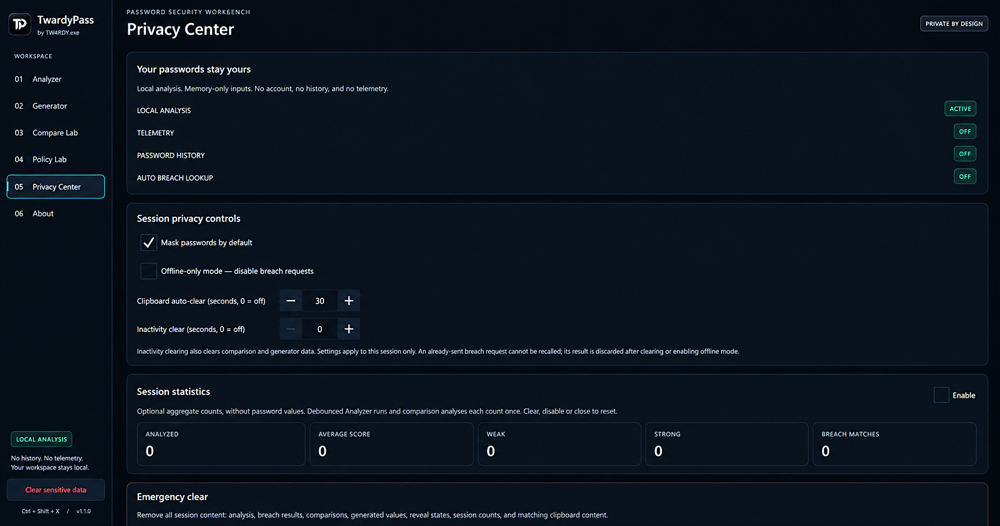
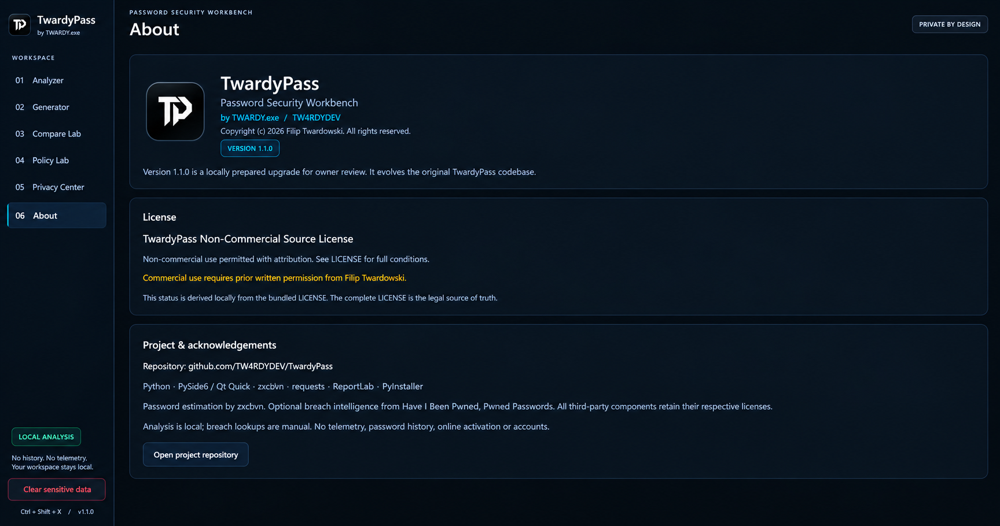

# TwardyPass v1.1.0

**Password Security Workbench — by TWARDY.exe / TW4RDYDEV**

Original project by **Filip Twardowski / TW4RDYDEV / TWARDY.exe**.
Copyright (c) 2026 Filip Twardowski. All rights reserved.

## Overview

A privacy-first desktop workbench for understanding password strength, generating
credentials and comparing alternatives. Python, PySide6/Qt Quick, zxcvbn and local
structural checks power the application. No cloud account is required.

## Preview

The v1.1.0 preview uses obvious dummy input, masked on screen:








## Features

- Full-length local structural analysis up to 8,192 Unicode code points.
- 0–100 explanatory score, zxcvbn guessing estimates, animated score ring.
- Five-axis Security DNA radar; breach safety remains unknown until checked.
- Pattern inspector for sequences, keyboard walks, repetition, common words,
  dictionary-derived patterns, years, personal terms and predictable suffixes.
  Findings do not expose matched password fragments.
- Manual HIBP lookup with k-anonymity, response padding and stale-result protection.
- Password generator presets: Balanced, Maximum Security, Website Compatible,
  Easy to Type, Custom; selected categories and custom exclusions are enforced.
- Configurable passphrases: 4–12 compound word tokens, separators, capitalization,
  optional random two-digit number and symbol. Entropy reflects the actual space.
- Three equal-width Compare Lab candidates, independent reveals, comparison matrix.
- Policy Lab: Balanced, High Security, NIST-inspired and Custom, with per-rule results.
  NIST-inspired is not an official compliance claim.
- Sanitized JSON/PDF exports of the current Analyzer assessment and policy result.
- Privacy Center: default masking, clipboard timer, inactivity clearing, offline mode,
  optional memory-only aggregate statistics, shared emergency clear.
- TP application icon; modular QML; local license display; portable Windows build recipe.

## Privacy model

Analyzed and generated passwords are held in memory and are not saved or logged by
the application. Personal context is local. No telemetry, analytics, history,
remote activation, hardware identification or online license verification exists.
Settings and optional aggregate statistics are session-only.

`Ctrl+Shift+X`, the sidebar button, and the Privacy Center emergency button call the
same clearing function. They clear UI values and results, comparisons, generator
output, reveals, matching clipboard content and statistics. Queued breach results
are invalidated. Closing the app also clears the matching clipboard value.

Clearing releases application-held values; Python/Qt immutable strings cannot be
forensically zeroed. OS swap, clipboard history and other clipboard applications
are outside the application's control. An already-sent HTTP request cannot be
recalled, but its result is ignored after clearing or enabling offline-only mode.

The clipboard timer clears only when the clipboard still equals the copied value.
Set it to 0 to disable the timer. Inactivity clearing is opt-in and clears the whole
sensitive session. Turn on offline-only mode to block breach requests.

## HIBP architecture

Only an explicit Analyzer button click starts a lookup:

1. SHA-1 is calculated locally.
2. Only the first **five hexadecimal characters** are sent over HTTPS to the
   Pwned Passwords range endpoint, with `Add-Padding: true`.
3. Returned hash suffixes are compared locally. Zero-count padding is ignored.
4. Requests time out; redirects and malformed responses are not treated as a clean result.
5. A request revision prevents old responses appearing for changed/cleared inputs.

No password or full hash is transmitted. The application says **“No match found
in the Pwned Passwords dataset.”** This does not prove the password has never leaked.
Compare Lab never performs HIBP requests.

## Installation and running from source

Windows 10/11, Python 3.12 recommended (source requires Python 3.10+):

```powershell
py -3.12 -m venv .venv
.\.venv\Scripts\Activate.ps1
python -m pip install -r requirements.txt -c constraints.txt
python main.py
```

The source ZIP is a complete project and does not require Git. Run `main.py` from
this folder. Dependencies need internet access to install; routine analysis does not.

## Windows portable build

```powershell
.\scripts\build_windows.ps1 -Python .\.venv\Scripts\python.exe
```

The script installs build/test dependencies, runs Ruff and pytest, then builds with
PyInstaller. Use `-SkipInstall` when dependencies are already installed.

Output: `dist/TwardyPass/TwardyPass.exe`. Distribute the **whole** `dist/TwardyPass`
folder, including `_internal` and LICENSE.txt. Users of that portable build do not
need Python. The build includes QML, TP icons, license data and Windows version metadata.
The executable is unsigned. Source-control archives should exclude `dist/` and `build/`.

## Usage

1. **Analyzer:** type or paste a password. Use optional comma-separated personal context.
   The full input scrolls horizontally; reveal is explicit. Results update after a short debounce.
2. **Generator:** select a preset or customize categories and exclusions, then Generate.
   Passphrase mode uses adjective+noun compounds from the existing bundled word lists.
3. **Compare Lab:** enter up to three candidates and analyze individually or all at once.
   Editing a candidate immediately invalidates its old score.
4. **Policy Lab:** evaluates the current Analyzer input. A required breach rule fails
   until the same input receives a completed manual no-match result. Changing rules
   invalidates the previous policy result.
5. **Exports:** choose JSON or PDF in Analyzer. Reports omit passwords, context, hashes,
   matched text and arbitrary analysis descriptions. Recommendations are fixed safe guidance.
6. **Privacy:** adjust session controls. Statistics count completed non-empty analyses;
   repeated analyses of the same value count separately, without retaining that value.

## Architecture

- `main.py`: application startup, system fonts, metadata, TP icon, QML engine.
- `app/version.py`: authoritative application version; reused by packaging, UI and reports.
- `app/bridge.py`: Qt boundary, current Analyzer state, request revisions, timers and clearing.
- `app/backend/analyzer.py`: existing analyzer extended with typed, private findings.
- `app/backend/generator.py`: `secrets`-based generators and exact constrained output-space counting.
- `app/backend/breach_checker.py`: manual HTTPS range client and local matching.
- `app/backend/policy.py`, `reports.py`, `session.py`, `license_info.py`: focused local services.
- `app/ui/theme/`: shared color system; `components/`: reusable controls and charts;
  `pages/`: Analyzer, Generator, Compare, Policy, Privacy and About.
- `assets/`: PNG, SVG and multi-size Windows ICO.
- `scripts/build_windows.ps1`, `TwardyPass.spec`: portable packaging.

## Tests

```powershell
python -m pip install -r requirements-dev.txt -c constraints.txt
python -m ruff check .
python -m pytest -v
```

Original tests are retained. New coverage includes Unicode and 8,192-character inputs,
QVariant-safe guesses, generator constraints/entropy, passphrases, policy rules,
license classification, report text sanitization, mocked HIBP transport/parsing,
clipboard behavior, stale-result rejection, inactivity clearing and QML interactions.
The GUI test checks all six pages at 1180×720, 1440×900, 1920×1080 and 2560×1440,
equal Compare widths and the actual panic shortcut. HTTP is mocked in tests.

GitHub Actions in `.github/workflows/` run CI on pushes and pull requests and provide an optional manually triggered Windows portable-build artifact.

## Limits and roadmap

Estimates are educational approximations. Above 128 characters, zxcvbn samples the
first and last 64 characters while structural checks cover the full input.
Character-space entropy for user-entered passwords assumes random selection and
may substantially overestimate a human-chosen password's uncertainty. Generator
entropy uses the actual constrained space instead.

The retained compound-token word lists are small; longer passphrases compensate,
and deterministic capitalization/separators add no entropy. Policy rules are
heuristics, not a compliance certification. No background breach monitoring exists.

Future work: larger audited passphrase lists, broader accessibility and DPI testing,
additional native platform packaging, and signed Windows distribution.

## License

The bundled [LICENSE](LICENSE) is unchanged and authoritative: the **TwardyPass
Non-Commercial Source License**. Non-commercial use, modification and redistribution
are permitted under its conditions, including attribution. Commercial use requires
prior written permission from **Filip Twardowski**. Commercial licensing requests
may be made through the owner's GitHub profile.

The About display classifies LICENSE locally and falls back to “See bundled LICENSE
for full terms” when uncertain. This software is source-available, not represented
as OSI-approved open source.

## Credits

Original author: **Filip Twardowski / TW4RDYDEV / TWARDY.exe**.
Project: <https://github.com/TW4RDYDEV/TwardyPass>.
Thanks to Python, Qt/PySide6, zxcvbn, requests, ReportLab, PyInstaller and HIBP Pwned
Passwords. Third-party components retain their respective licenses.
